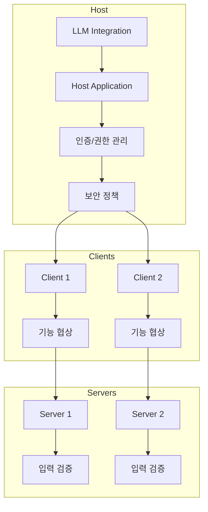

# MCP 서버 소개

## 목차

### 1. [MCP 서버란?](#1-mcp-서버란)

- [MCP 서버의 가치](#11-mcp-서버의-가치)
- [주요 사용 사례](#12-주요-사용-사례)
- [서버 설정 및 초기화](#13-서버-설정-및-초기화)

### 2. [기본 아키텍처](#2-기본-아키텍처)

- [핵심 컴포넌트](#21-핵심-컴포넌트)
- [컴포넌트 역할 및 구현 패턴](#22-컴포넌트-역할-및-구현-패턴)

### 3. [주요 기능](#3-주요-기능)

- [Tools (도구)](#31-tools-도구)
- [Resources (리소스)](#32-resources-리소스)
- [Prompts (프롬프트)](#33-prompts-프롬프트)

### 4. [시작하기 전 필요한 지식](#4-시작하기-전-필요한-지식)

- [필수 지식](#41-필수-지식)
- [권장 지식](#42-권장-지식)

### 5. [문서 구조](#5-문서-구조)

- [핵심 기능](#51-핵심-기능)
- [최적화](#52-최적화)
- [보안](#53-보안)

### 6. [참고 자료](#6-참고-자료)

## 1. MCP 서버란?

MCP(Model Context Protocol) 서버는 LLM(Large Language Model)에 컨텍스트를 제공하는 표준화된 프로토콜을 구현하는 서버입니다. 이는 AI 애플리케이션을 위한 "USB-C 포트"와 같은 역할을 하며, AI 모델과 다양한 데이터 소스/도구를 연결하는 표준화된 방법을 제공합니다.

### 1.1 MCP 서버의 가치

- **표준화**: 다양한 AI 애플리케이션과 데이터 소스 간의 일관된 통신 방식 제공
- **확장성**: 새로운 도구와 리소스를 쉽게 추가할 수 있는 모듈식 구조
- **보안**: 격리된 환경에서 안전한 데이터 접근과 도구 실행 보장 (예: 허용된 디렉토리/확장자만 접근 제어)
- **유지보수성**: 명확한 책임 분리와 표준화된 인터페이스로 유지보수 용이
- **Model-Controlled**: AI 모델이 자동으로 사용할 수 있는 특성 지원

<Warning>
보안과 신뢰성을 위해 인간의 승인이 필요하거나, 강력한 접근 제어 매커니즘 구현이 필수적입니다. 구현 시 다음 사항을 고려해야 합니다:
- AI 모델에 노출되는 기능을 명확히 식별하고 최소화
- 기능 사용 시 시각적 표시 제공 및 로깅
- 작업 수행 전 사용자 확인 프롬프트 또는 엄격한 정책 기반 접근 제어 적용 (예: 특정 파일 서버 구현 시 `allowedDirectories`, `allowedExtensions` 설정을 통해 접근 가능한 파일 경로와 종류를 제한)
- 모든 입력값에 대한 철저한 검증 (Path Traversal 등 공격 방지)
</Warning>

### 1.2 주요 사용 사례

- **개발 도구 통합**: IDE나 코드 에디터에 AI 기능을 통합하여 코드 생성, 수정, 분석 지원
- **데이터 분석**: 데이터베이스나 파일 시스템과의 연동하여 데이터 조회 및 처리 (예: `mcp-file-server`는 LLM 에이전트가 지정된 로컬 디렉토리 내 파일을 읽고 쓰는 기능 제공)
- **외부 API 연동**: 날씨 정보, 주식 시세 등 외부 서비스 API와의 통합
- **커스텀 도구 개발**: 특정 도메인(예: 사내 시스템 접근)에 특화된 도구 구현
- **AI 모델 통합**: 다양한 AI 모델과의 안전한 통합 및 컨텍스트 제공

### 1.3 서버 설정 및 초기화

- **초기 설정 단계**: 많은 MCP 서버 구현체는 클라이언트 연결 후 초기 설정 단계를 요구합니다. 이 단계는 서버 운영에 필요한 필수 정보(예: 보안 파라미터, 작업 디렉토리 등)를 클라이언트로부터 전달받는 데 사용됩니다.
- **동적 핸들러 등록**: 예를 들어, `mcp-file-server`에서는 `server/config` 요청을 통해 `allowedDirectories`와 같은 설정을 받은 후에야 파일 접근 관련 Tool, Resource, Prompt 핸들러를 서버에 등록합니다. 이는 설정이 완료되기 전까지 관련 기능이 노출되지 않도록 보장하는 중요한 패턴입니다.

## 2. 기본 아키텍처

### 2.1 핵심 컴포넌트



### 2.2 컴포넌트 역할 및 구현 패턴

- **Host**:

  - 여러 클라이언트를 관리하고 LLM과 통합
  - 인증 및 권한 관리
  - 보안 정책 적용
  - 인간 승인 루프 관리

- **Client**:

  - 서버와의 1:1 연결을 관리
  - 기능 협상 처리 (서버가 제공하는 기능 목록 확인)
  - 세션 상태 유지
  - 메시지 라우팅 및 응답 처리

- **Server**:
  - 특정 기능(Tools, Resources, Prompts)과 리소스를 제공
  - 입력 검증 및 처리 (보안의 핵심)
  - Model-Controlled 특성 지원
  - 보안 제약 준수 (예: 허용된 범위 내에서만 작업 수행)
  - **구현 패턴**: 실제 서버 구현 시, 기능별 로직을 관리하는 'Manager' 계층(예: `ToolManager`, `ResourceManager`)과 실제 작업을 수행하는 'Service' 계층(예: `FileService`, `DatabaseService`)으로 나누어 책임 분리와 테스트 용이성을 높이는 경우가 많습니다.

## 3. 주요 기능

### 3.1 Tools (도구)

- LLM이 호출할 수 있는 함수 제공 (예: 특정 계산 수행, 파일 쓰기, API 호출)
- **예시 (`mcp-file-server`)**:
  - `readFile(path: string)`: 지정된 경로의 파일 내용을 읽음
  - `writeFile(path: string, content: string)`: 지정된 경로에 파일 내용을 씀
  - `listDirectory(path: string)`: 지정된 디렉토리의 파일 및 하위 디렉토리 목록을 반환
  - `createDirectory(path: string)`: 지정된 경로에 디렉토리를 생성
- 사용자 승인이 필요한 작업 처리 또는 정책 기반 자동 실행
- Model-Controlled 특성 지원
- **보안**: 모든 입력 파라미터(특히 경로 관련)는 서버 측에서 반드시 검증하여 Path Traversal과 같은 취약점을 방지해야 합니다.

### 3.2 Resources (리소스)

- LLM에게 제공될 수 있는 정적인 데이터 조각 (예: 파일 내용, 데이터베이스 레코드)
- URI 기반 접근 패턴 사용 (예: `file:///path/to/resource.txt`, `db://table/id`)
- **예시 (`mcp-file-server`)**:
  - 서버 설정 시 지정된 `allowedDirectories` 내의 특정 하위 디렉토리(예: `resources`)에 있는 파일들을 리소스로 관리합니다.
  - 클라이언트가 `resources/list`를 요청하면, 해당 디렉토리 내 파일 목록을 `file://` URI 형태로 반환합니다. (예: `file://resources/example.json`)
  - LLM은 이 URI를 사용하여 프롬프트에 해당 파일 내용을 포함시키도록 요청할 수 있습니다.
- 데이터 형식 및 인코딩 처리
- **접근 제어**: 서버는 URI를 해석하여 요청된 리소스가 허용된 범위(예: `allowedDirectories`) 내에 있는지 반드시 확인해야 합니다.

### 3.3 Prompts (프롬프트)

- LLM에게 작업을 지시하기 위한 일관된 형식의 프롬프트 템플릿 제공
- 변수 치환과 컨텍스트(리소스 포함) 주입 지원
- **예시 (`mcp-file-server`)**:
  - 서버 설정 시 지정된 `allowedDirectories` 내의 특정 하위 디렉토리(예: `prompts`)에 JSON 형식으로 프롬프트 템플릿을 저장합니다.
  - 각 JSON 파일은 프롬프트 이름, 설명, 필요한 인수, 그리고 실제 프롬프트 메시지 구조(역할, 내용)를 정의합니다.
  - 클라이언트가 `prompts/get` 요청 시 인수를 함께 전달하면, 서버는 해당 JSON 템플릿을 읽어 변수를 치환하고 최종 프롬프트 메시지를 생성하여 반환합니다.
- 다국어 지원 가능
- Model-Controlled 특성 지원
- 보안 및 접근 제어 (허가되지 않은 프롬프트 템플릿 접근 방지)

## 4. 시작하기 전 필요한 지식

### 4.1 필수 지식

- JSON-RPC 프로토콜 이해
- 비동기 프로그래밍 개념 (Node.js, Python asyncio 등)
- RESTful API 설계 경험
- **보안**: 기본적인 웹 보안 취약점(XSS, CSRF, Path Traversal 등) 및 방어 전략, 접근 제어 개념
- AI 모델 통합 경험 (LLM API 사용 경험)

### 4.2 권장 지식

- LLM과의 상호작용 및 프롬프트 엔지니어링 경험
- 마이크로서비스 아키텍처 이해
- 컨테이너화(Docker) 및 배포 경험
- 모니터링 및 로깅 시스템 구축/사용 경험
- Model-Controlled 시스템 설계 경험

## 5. 문서 구조

### 5.1 핵심 기능

- [개요](02-core-features/overview.md)
- [프롬프트](02-core-features/prompts.md)
- [리소스](02-core-features/resources.md)
- [도구](02-core-features/tools.md)

### 5.2 최적화

- [최적화](03-optimization.md)
  - MCP 로깅 시스템
  - 성능 모니터링
  - 리소스 최적화
  - 비동기 작업 최적화
  - 모니터링 및 알림

### 5.3 보안

- [보안](04-security.md)
  - 보안 원칙
  - 위협 모델
  - 보안 아키텍처
  - 인증 및 권한
  - **접근 제어**: 허용된 디렉토리, 파일 확장자, 기능 사용 권한 등 구체적인 접근 제어 전략
  - **입력 검증**: 모든 클라이언트 입력값(특히 경로, URI, 파라미터)에 대한 철저한 검증 로직

## 폴더 구조

```
mcp-server/
├── 01-introduction.md        # 소개
├── 02-core-features/         # 핵심 기능
│   ├── overview.md
│   ├── prompts.md
│   ├── resources.md
│   └── tools.md
├── 03-optimization.md        # 최적화
└── 04-security.md           # 보안
```

## 주요 변경사항

### 2025-05-07

- 폴더 구조 단순화 및 번호 재정렬
- 문서 구조 단순화 및 핵심 내용 중심으로 재구성
- 성능 및 보안 관련 내용 통합

### (날짜 미정)

- `mcp-file-server` 예시 추가
- 보안 및 접근 제어 내용 강화
- 서버 설정 단계 섹션 추가
- 구현 패턴 내용 추가

## 라이선스

이 프로젝트는 MIT 라이선스 하에 배포됩니다. 자세한 내용은 [LICENSE](LICENSE) 파일을 참조하세요.
