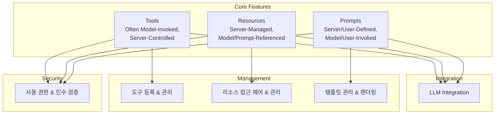
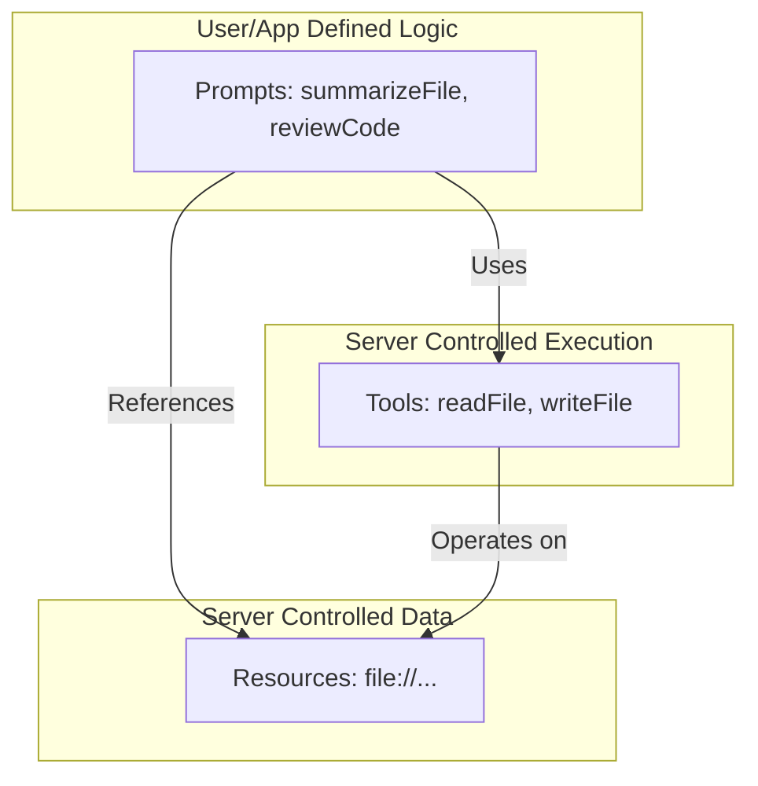
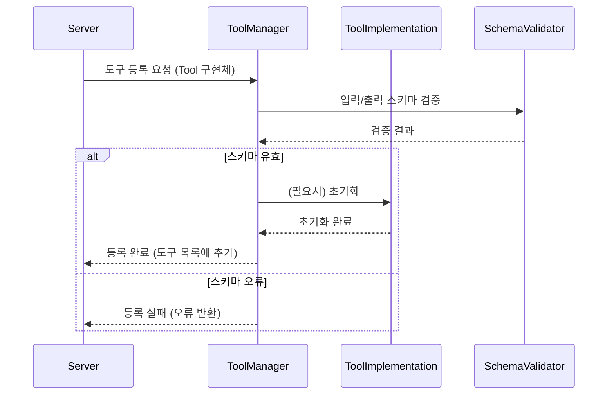
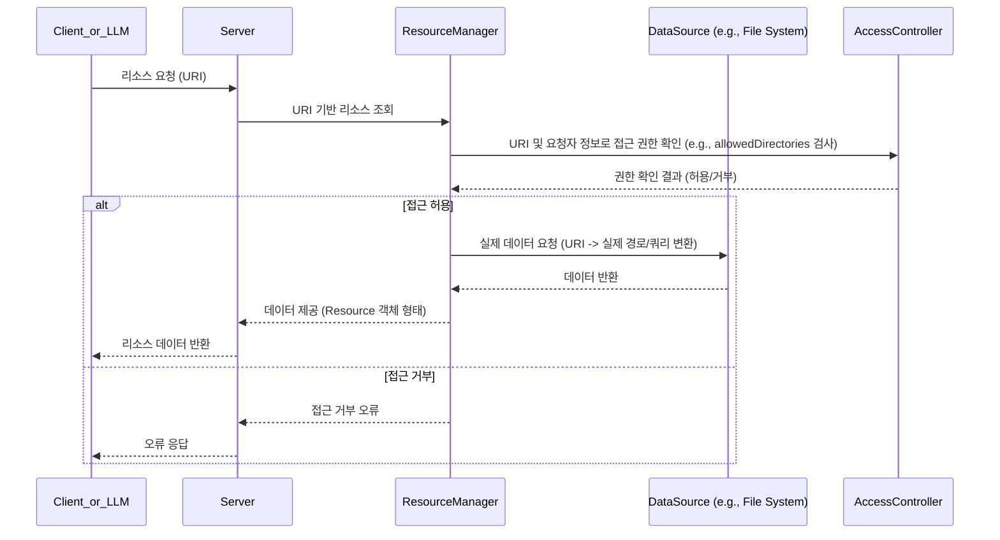
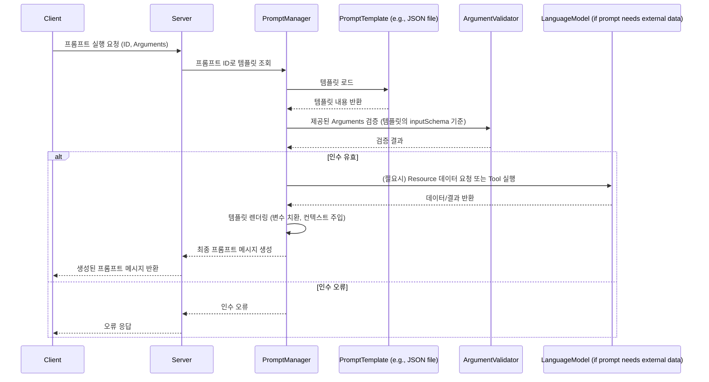

# MCP 서버 핵심 기능 구현

## 1. 개요

MCP 서버의 핵심 기능은 크게 세 가지로 구성됩니다: Tools(도구), Resources(리소스), Prompts(프롬프트). 각 기능은 독립적으로 구현되며, 서로 유기적으로 연동되어 작동합니다.

### 1.1 핵심 기능 구조



<Warning>
**보안 최우선:** MCP 서버 구현 시 보안은 가장 중요한 고려사항입니다. 기능 구현 전반에 걸쳐 다음 사항을 반드시 검토하고 적용해야 합니다:
- **최소 권한 원칙:** AI 모델과 클라이언트에게 필요한 최소한의 기능과 데이터 접근 권한만 부여합니다.
- **명확한 기능 표시 및 로깅:** AI 모델에 노출되는 모든 기능(특히 파일 수정/삭제 등 위험 가능성이 있는 도구)은 명확히 식별하고, 모든 작업은 감사 가능한 로그를 남깁니다.
- **강력한 접근 제어:** 사용자 확인 프롬프트 외에도, 서버 설정(예: `allowedDirectories`, `allowedExtensions`)을 통해 접근 가능한 경로, 파일 형식, 사용 가능한 도구/프롬프트를 엄격히 제한합니다.
- **철저한 입력 검증:** 클라이언트로부터 받는 모든 입력(경로, URI, 도구 인수 등)은 서버 측에서 반드시 검증하여 Path Traversal, Injection 공격 등을 방지합니다.
</Warning>

### 1.2 핵심 기능 상호작용



각 핵심 기능은 다음과 같은 상호작용 패턴을 가집니다:

1.  **Tools와 Resources 상호작용**

    - Tools는 Resources로 식별되는 데이터(예: 파일)를 읽거나 수정합니다. (예: `readFile` Tool이 `file://resources/report.txt` Resource를 읽음, `writeFile` Tool이 해당 Resource를 수정)
    - Resources는 Tools 실행의 대상이 됩니다.
    - **보안**: Tool이 Resource에 접근할 때 서버는 항상 접근 권한(설정된 `allowedDirectories` 등)을 확인해야 합니다.

2.  **Prompts와 Tools 상호작용**

    - Prompts는 특정 작업을 수행하기 위해 Tools를 호출하는 로직을 포함할 수 있습니다. (예: 코드 리뷰 Prompt가 `readFile` Tool을 호출하여 대상 코드 파일 내용을 가져옴)
    - Tools의 실행 결과는 Prompts의 컨텍스트로 사용될 수 있습니다.
    - **보안**: Prompt가 위험한 Tool(예: `deleteFile`)을 호출하지 못하도록 제한하거나 사용자 확인이 필요합니다.

3.  **Prompts와 Resources 상호작용**
    - Prompts는 LLM에게 컨텍스트를 제공하기 위해 하나 이상의 Resources를 참조할 수 있습니다. (예: 여러 문서 파일 Resources를 참조하여 요약 보고서를 생성하는 Prompt)
    - **보안**: Prompt가 참조하는 Resource URI는 서버에서 유효성을 검증하고 접근 권한을 확인해야 합니다.

## 2. Tools (도구) 구현

### 2.1 도구 정의

- LLM이 호출하거나(Model-Invoked), 서버 내부 로직 또는 사용자 요청에 의해 실행될 수 있는 기능 단위입니다.
- 각 도구는 명확한 입력/출력 인터페이스(JSON Schema 권장)를 가져야 합니다.
- **Annotations**: 도구의 특성(읽기 전용, 파괴적 작업 등)을 명시하여 안전한 사용을 돕습니다. (예: `writeFile`은 `destructiveHint: true`, `readFile`은 `readOnlyHint: true`)

### 2.2 도구 등록 프로세스



### 2.3 도구 구현 예시

```typescript
// SDK 또는 공통 타입 정의 (가상)
import {
  Tool,
  ToolResult,
  TextContent,
  McpError,
  ErrorCode,
  ToolInputSchema,
} from "@mcp/sdk";
import { FileService } from "./fileService"; // 파일 작업을 처리하는 서비스

// 예시 1: 파일 읽기 도구
class ReadFileTool implements Tool {
  name = "readFile";
  description = "지정된 경로의 파일 내용을 읽습니다.";
  inputSchema: ToolInputSchema = {
    type: "object",
    properties: {
      path: { type: "string", description: "읽을 파일의 상대 경로" },
    },
    required: ["path"],
  };
  annotations = { readOnlyHint: true };

  constructor(private fileService: FileService) {}

  async execute(params: { path: string }): Promise<ToolResult> {
    try {
      // FileService를 통해 경로 검증 및 파일 읽기 수행
      const content = await this.fileService.readFile(params.path);
      return { content: [{ type: "text", text: content }] };
    } catch (error: any) {
      // 파일 없음, 권한 없음 등 오류 처리
      throw new McpError(
        ErrorCode.InternalError,
        `readFile 실패: ${error.message}`
      );
    }
  }
}

// 예시 2: 파일 쓰기 도구
class WriteFileTool implements Tool {
  name = "writeFile";
  description = "지정된 경로에 파일 내용을 씁니다. (기존 파일 덮어쓰기)";
  inputSchema: ToolInputSchema = {
    type: "object",
    properties: {
      path: { type: "string", description: "쓸 파일의 상대 경로" },
      content: { type: "string", description: "파일에 쓸 내용" },
    },
    required: ["path", "content"],
  };
  annotations = { destructiveHint: true }; // 파괴적인 작업임을 명시

  constructor(private fileService: FileService) {}

  async execute(params: {
    path: string;
    content: string;
  }): Promise<ToolResult> {
    try {
      // FileService를 통해 경로 검증 및 파일 쓰기 수행
      await this.fileService.writeFile(params.path, params.content);
      return {
        content: [{ type: "text", text: `${params.path} 파일 저장 완료` }],
      };
    } catch (error: any) {
      // 권한 없음, 디스크 공간 부족 등 오류 처리
      throw new McpError(
        ErrorCode.InternalError,
        `writeFile 실패: ${error.message}`
      );
    }
  }
}
```

## 3. Resources (리소스) 구현

### 3.1 리소스 정의

- LLM 또는 Prompt가 참조할 수 있는 데이터 단위입니다.
- URI(Uniform Resource Identifier)를 통해 고유하게 식별됩니다. (예: `file://relative/path/to/file.txt`)
- 서버는 URI를 해석하여 실제 데이터 소스(파일, DB 등)에 접근하고, 접근 권한을 반드시 확인해야 합니다.

### 3.2 리소스 접근 프로세스



### 3.3 리소스 구현 예시

```typescript
// SDK 또는 공통 타입 정의 (가상)
import {
  Resource,
  ResourceResult,
  TextContent,
  AccessControlPolicy,
} from "@mcp/sdk";
import { FileService } from "./fileService";

class FileResource implements Resource {
  uri: string; // 예: "file://documents/project-spec.md"
  type = "file";
  // 접근 정책은 서버 설정(e.g., allowedDirectories)에서 파생될 수 있음
  accessPolicy: AccessControlPolicy;

  constructor(
    uri: string,
    private fileService: FileService,
    policy: AccessControlPolicy
  ) {
    this.uri = uri;
    this.accessPolicy = policy;
  }

  // 실제 데이터 접근은 필요 시점에 발생 (예: LLM이 프롬프트에 포함 요청 시)
  async getData(): Promise<ResourceResult> {
    // 1. URI에서 상대 경로 추출 (예: "documents/project-spec.md")
    const relativePath = this.uri.replace(/^file:\/\//, "");

    // 2. FileService를 사용하여 경로 유효성 검사 및 파일 읽기
    // FileService 내에서 accessPolicy (allowedDirectories 등)를 기반으로 검증 수행
    try {
      const content = await this.fileService.readFile(relativePath); // FileService가 접근 제어 수행
      return { content: [{ type: "text", text: content }] };
    } catch (error: any) {
      throw new McpError(
        ErrorCode.NotFound,
        `리소스 접근 실패 (${this.uri}): ${error.message}`
      );
    }
  }

  getMetadata(): { size?: number; lastModified?: Date } {
    // 파일 메타데이터 제공 로직 (FileService 사용)
    return {};
  }
}
```

## 4. Prompts (프롬프트) 구현

### 4.1 프롬프트 정의

- LLM에게 작업을 지시하거나 특정 형식의 응답을 유도하기 위한 템플릿입니다.
- 입력 변수를 받아 동적으로 내용을 구성하고, 필요시 Resources를 컨텍스트로 포함할 수 있습니다.
- **구현 방식**: 서버는 종종 특정 디렉토리(예: `prompts`)에 있는 JSON 또는 YAML 파일들을 로드하여 프롬프트 템플릿을 관리합니다.

### 4.2 프롬프트 처리 프로세스



### 4.3 프롬프트 구현 예시

```json
// 예시: prompts/summarize_file.json
{
  "id": "summarize_file",
  "description": "지정된 파일의 내용을 요약합니다.",
  "inputSchema": {
    "type": "object",
    "properties": {
      "fileUri": {
        "type": "string",
        "description": "요약할 파일의 Resource URI (예: file://documents/report.txt)"
      },
      "maxLength": {
        "type": "integer",
        "description": "최대 요약 길이 (단어 수)",
        "default": 100
      }
    },
    "required": ["fileUri"]
  },
  "messages": [
    {
      "role": "system",
      "content": [
        {
          "type": "text",
          "text": "당신은 주어진 텍스트를 간결하게 요약하는 AI 비서입니다."
        }
      ]
    },
    {
      "role": "user",
      "content": [
        {
          "type": "text",
          "text": "다음 파일 내용을 {{maxLength}} 단어 내외로 요약해주세요:"
        },
        {
          "type": "resource",
          "uri": "{{fileUri}}" // 입력된 fileUri 변수가 여기에 주입됨
        }
      ]
    }
  ]
}
```

```typescript
// 서버의 PromptManager (가상)
import {
  PromptResult,
  GetPromptParams,
  McpError,
  PromptTemplate,
} from "@mcp/sdk";
import { ResourceManager } from "./resourceManager";

class PromptManager {
  private templates: Map<string, PromptTemplate> = new Map();

  constructor(private resourceManager: ResourceManager) {}

  loadPromptTemplates(directoryPath: string) {
    // 디렉토리에서 JSON 파일들을 읽어 templates Map에 로드
  }

  async renderPrompt(params: GetPromptParams): Promise<PromptResult> {
    const template = this.templates.get(params.name);
    if (!template) {
      throw new McpError(
        ErrorCode.NotFound,
        `프롬프트 템플릿 ${params.name}을(를) 찾을 수 없습니다.`
      );
    }

    // 1. 입력 인수 검증 (template.inputSchema 사용)
    validateArguments(params.arguments, template.inputSchema);

    // 2. 템플릿 렌더링 (변수 치환)
    const renderedMessages = [];
    for (const message of template.messages) {
      const renderedContent = [];
      for (const contentItem of message.content) {
        if (contentItem.type === "text") {
          // Mustache, Handlebars 등 템플릿 엔진 사용 가능
          renderedContent.push({
            type: "text",
            text: renderTemplateString(contentItem.text, params.arguments),
          });
        } else if (contentItem.type === "resource") {
          // Resource URI 변수 치환
          const resourceUri = renderTemplateString(
            contentItem.uri,
            params.arguments
          );
          // ResourceManager를 통해 실제 리소스 데이터 로드 (이 단계 또는 LLM 전달 직전)
          // const resourceData = await this.resourceManager.getResourceData(resourceUri);
          // 여기서는 URI만 전달하고, 실제 데이터 로드는 최종 단계에서 할 수도 있음
          renderedContent.push({ type: "resource", uri: resourceUri });
        } else {
          renderedContent.push(contentItem);
        }
      }
      renderedMessages.push({ role: message.role, content: renderedContent });
    }

    return { description: template.description, messages: renderedMessages };
  }
}
```

## 5. 통합 구현

### 5.1 기능 통합

- 서버는 클라이언트 요청을 받아 인증/인가를 수행하고, 적절한 Manager(ToolManager, ResourceManager, PromptManager)에게 작업을 위임합니다.
- 각 Manager는 자신의 책임 영역 내에서 작업을 처리하고, 필요시 다른 Manager 또는 Service(FileService 등)와 상호작용합니다.
- 모든 상호작용 경로에서 보안(접근 제어, 입력 검증)이 적용되어야 합니다.

### 5.2 통합 예시 (단순화된 요청 처리 흐름)

```typescript
class MCPServer {
  private authService: AuthService;
  private toolManager: ToolManager;
  private resourceManager: ResourceManager;
  private promptManager: PromptManager;
  private auditLogger: AuditLogger;

  // ... 초기화 로직 ...

  async handleRequest(request: MCPRequest) {
    try {
      // 1. 인증/인가 확인 (메타데이터 또는 세션 기반)
      const userContext = await this.authService.verify(request);

      // 2. 요청 유형에 따라 분기 (tool/call, resources/list, prompts/get 등)
      switch (request.method) {
        case "tools/call":
          // 접근 제어 확인 (userContext 기반으로 해당 도구 실행 권한 확인)
          await this.authService.checkToolPermission(
            userContext,
            request.params.name
          );
          // ToolManager에게 실행 위임
          const toolResult = await this.toolManager.executeTool(
            request.params.name,
            request.params.arguments
          );
          // 감사 로깅
          await this.auditLogger.logToolCall(
            userContext,
            request.params,
            toolResult
          );
          return toolResult;

        case "resources/list":
          // ResourceManager에게 위임 (내부적으로 접근 가능한 리소스만 반환)
          const resources = await this.resourceManager.listResources(
            userContext
          );
          return { resources };

        case "prompts/get":
          // PromptManager에게 위임 (내부적으로 권한 확인 및 렌더링)
          const promptResult = await this.promptManager.renderPrompt(
            request.params
          );
          return promptResult;

        // ... 기타 메소드 핸들러 ...

        default:
          throw new McpError(
            ErrorCode.MethodNotFound,
            `메소드 ${request.method}를 찾을 수 없습니다.`
          );
      }
    } catch (error) {
      // 오류 처리 및 로깅
      await this.auditLogger.logError(request, error);
      // 클라이언트에게 표준 오류 형식으로 반환
      throw mapErrorToMcpError(error);
    }
  }
}
```

## 6. 구현 시 고려사항

### 6.1 성능

- 비동기 처리 최적화 (Node.js 이벤트 루프 논블로킹 유지)
- 리소스(파일 핸들, DB 커넥션) 효율적 관리 및 풀링
- 필요시 캐싱 전략 적용 (리소스 데이터, 프롬프트 템플릿 등)
- 적절한 타임아웃 설정 (외부 API 호출, 장기 실행 도구 등)

### 6.2 보안

- **입력 검증**: 모든 외부 입력(JSON-RPC 요청 파라미터)에 대해 JSON Schema 등을 사용한 철저한 검증. 특히 경로 문자열에 대한 Path Traversal 시도 방지.
- **접근 제어**: 설정 파일(`allowedDirectories`, `allowedExtensions` 등) 또는 역할 기반(RBAC)/속성 기반(ABAC) 정책을 통해 리소스 및 기능 접근 제어.
- **출력 인코딩**: LLM 응답 또는 파일 내용을 클라이언트에게 전달 시 적절한 인코딩 및 스크립트 이스케이핑 처리.
- 데이터 암호화: 저장되거나 전송되는 민감 데이터 암호화.
- **감사 로깅**: 모든 중요한 작업(도구 실행, 리소스 접근, 설정 변경)에 대한 상세한 로그 기록.
- 도구/리소스/프롬프트 어노테이션 활용 (예: `destructiveHint` 도구 실행 전 추가 확인)

### 6.3 확장성

- 플러그인 아키텍처: 새로운 Tool, Resource, Prompt 유형을 쉽게 추가할 수 있는 구조.
- 모듈식 설계: Manager, Service 계층 분리 등.
- 인터페이스 표준화: 내부 컴포넌트 간, 외부 API와의 명확한 인터페이스 정의.
- 버전 관리: API 및 기능 변경에 대한 버전 관리.

## 7. 다음 단계

이 문서를 통해 MCP 서버의 핵심 기능 구현 방법을 이해했다면, 다음 문서들을 통해 더 자세한 내용을 학습할 수 있습니다:

1.  [Tools 구현 상세](tools.md)
    - 도구 설계 패턴
    - 에러 처리
    - 테스트 방법
2.  [Resources 구현 상세](resources.md)
    - 리소스 관리
    - 캐싱 전략
    - 동기화 메커니즘
3.  [Prompts 구현 상세](prompts.md)
    - 템플릿 설계
    - 변수 처리
    - 다국어 지원
