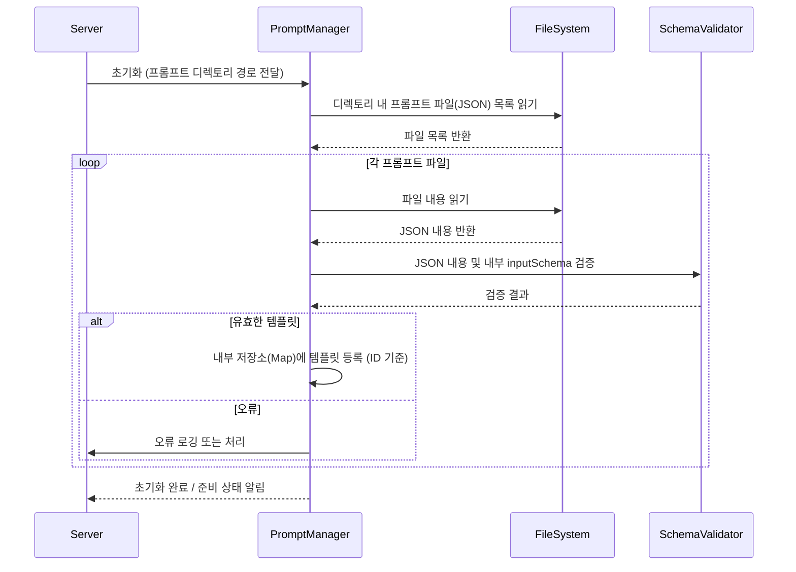

# MCP 서버 Prompts 구현 상세

## 1. Prompts 개요

Prompts는 MCP 서버에서 LLM(Large Language Model)과의 상호작용을 위한 구조화된 메시지 템플릿 시스템입니다. 서버는 미리 정의된 템플릿을 사용하여 클라이언트 또는 AI 모델의 요청에 따라 동적으로 완성된 프롬프트 메시지 목록을 생성합니다.

### 1.1 프롬프트의 특징

- **템플릿 기반**: 재사용 가능한 형식으로 정의됩니다. (예: JSON 파일)
- **구조화된 메시지**: LLM API가 요구하는 형식(예: 역할(role)과 내용(content)을 가진 메시지 배열)으로 출력을 생성합니다.
- **변수 치환**: 요청 시 제공되는 인수(arguments)를 사용하여 템플릿 내 변수를 동적으로 채웁니다.
- **리소스 참조**: 템플릿 내에서 Resource URI를 참조하여 LLM에게 관련 컨텍스트를 제공할 수 있습니다.
- **서버 관리**: 일반적으로 서버 측에서 템플릿을 정의하고 관리합니다. (예: 특정 디렉토리에서 템플릿 파일 로드)
- **Model Usable**: AI 모델이 `prompts/get`과 같은 표준 메소드를 통해 사용할 수 있도록 설계됩니다.

<Warning>
**보안 고려사항:**
- **인수 검증:** 클라이언트가 제공하는 모든 프롬프트 인수(`arguments`)는 템플릿에 정의된 `inputSchema`에 따라 엄격하게 검증해야 합니다. 예상치 못한 값이나 악의적인 입력(예: 경로 조작 시도)을 차단해야 합니다.
- **리소스 URI 검증:** 프롬프트 템플릿 내에서 사용되거나 인수로 전달된 Resource URI는 서버의 접근 제어 정책(예: `allowedDirectories`)에 따라 유효성과 접근 권한을 반드시 확인해야 합니다. LLM에게 허가되지 않은 파일 경로가 노출되어서는 안 됩니다.
- **프롬프트 노출 제어:** 민감한 정보를 포함하거나 위험한 작업을 유도할 수 있는 프롬프트 템플릿은 접근을 제한해야 합니다.
</Warning>

### 1.2 프롬프트 사용 예시 시나리오

- **텍스트 요약:** 사용자가 파일 URI를 제공하면, 해당 파일을 읽어(내부적으로 `readFile` Tool 사용 또는 Resource 참조) 내용을 요약하는 프롬프트를 생성합니다.
- **코드 리뷰:** 사용자가 코드 파일 URI와 리뷰 포인트를 제공하면, 해당 파일 내용을 포함하여 코드 리뷰를 요청하는 프롬프트를 생성합니다.
- **데이터 기반 질의응답:** 사용자가 질문과 관련 데이터 파일 URI 목록을 제공하면, 해당 파일들을 컨텍스트로 포함하여 질문에 답변하도록 요청하는 프롬프트를 생성합니다.

## 2. 프롬프트 구현 방법 (파일 기반)

`mcp-file-server`와 같이 파일 기반으로 프롬프트 템플릿을 관리하는 것이 일반적입니다. 각 프롬프트는 고유 ID를 가지며, 별도의 파일(주로 JSON)로 정의됩니다.

### 2.1 프롬프트 템플릿 정의 (JSON 예시)

```json
// file: {allowedDir}/prompts/generate_docs.json
{
  "id": "generate_docs", // 프롬프트의 고유 ID
  "description": "주어진 코드 파일에 대한 문서를 생성합니다.", // 프롬프트 설명
  "inputSchema": {
    // 프롬프트 실행 시 필요한 인수 정의 (JSON Schema)
    "type": "object",
    "properties": {
      "codeFileUri": {
        // 인수의 이름
        "type": "string",
        "description": "문서를 생성할 코드 파일의 Resource URI (e.g., file://src/main.ts)"
      },
      "outputFormat": {
        "type": "string",
        "description": "생성할 문서 형식",
        "enum": ["markdown", "jsdoc"],
        "default": "markdown"
      }
    },
    "required": ["codeFileUri"] // 필수 인수 지정
  },
  "messages": [
    // LLM에게 전달될 메시지 구조 템플릿
    {
      "role": "system",
      "content": [
        {
          "type": "text",
          "text": "당신은 코드 문서를 생성하는 AI 어시스턴트입니다. 주어진 코드 파일 내용을 바탕으로 {{outputFormat}} 형식의 문서를 작성해주세요."
        }
      ]
    },
    {
      "role": "user",
      "content": [
        {
          "type": "text",
          "text": "다음 코드 파일에 대한 문서를 생성해주세요:"
        },
        {
          "type": "resource", // 리소스 참조 타입
          "uri": "{{codeFileUri}}" // inputSchema의 codeFileUri 인수가 여기에 치환됨
        }
      ]
    }
    // 필요에 따라 assistant 역할의 예시 등을 추가할 수 있음
  ]
}
```

**주요 구성 요소:**

- `id`: 프롬프트를 식별하는 고유한 이름.
- `description`: 프롬프트의 목적이나 기능에 대한 설명.
- `inputSchema`: 이 프롬프트를 사용하기 위해 클라이언트가 `prompts/get` 요청 시 `arguments` 파라미터로 제공해야 하는 값들의 구조와 제약 조건을 JSON Schema 형식으로 정의합니다. 서버는 이 스키마를 사용하여 입력값 유효성을 검사합니다.
- `messages`: LLM API에 전달될 메시지 배열의 템플릿입니다.
  - `role`: 메시지 발신자 역할 (`system`, `user`, `assistant`).
  - `content`: 메시지 내용 배열.
    - `type`: 내용 유형 (`text`, `image`, `audio`, `resource` 등).
    - `text`: 텍스트 내용. `{{variable_name}}` 형식으로 변수를 포함할 수 있습니다. 서버는 `arguments`로 받은 값을 사용하여 이 변수를 치환합니다.
    - `uri`: `type`이 `resource`일 경우, 참조할 Resource의 URI. 이 URI 또한 `{{variable_name}}` 형식으로 변수를 포함할 수 있습니다. **서버는 이 URI의 유효성과 접근 권한을 반드시 검증해야 합니다.**

### 2.2 프롬프트 처리 과정

1.  **클라이언트 요청:** 클라이언트는 `prompts/get` 메소드를 호출하며, 사용할 프롬프트의 `id`와 `inputSchema`에 정의된 `arguments`를 파라미터로 전달합니다.
2.  **서버 (PromptManager):**
    a. 요청된 `id`에 해당하는 프롬프트 템플릿 파일을 로드합니다.
    b. 템플릿의 `inputSchema`를 사용하여 클라이언트가 제공한 `arguments`의 유효성을 검사합니다.
    c. 템플릿의 `messages` 배열을 순회하며, `content` 내의 변수(`{{variable_name}}`)를 검증된 `arguments` 값으로 치환합니다.
    d. `type`이 `resource`인 경우, 치환된 `uri`의 유효성과 접근 권한을 검사합니다. (실제 리소스 데이터 로드는 이 단계 또는 LLM 전달 직전에 수행될 수 있습니다.)
    e. 최종적으로 렌더링된 메시지 배열과 프롬프트 설명을 포함하는 `GetPromptResult` 객체를 생성하여 클라이언트에게 반환합니다.

## 3. 프롬프트 관리 (`PromptManager`)

서버는 프롬프트 템플릿을 로드, 검증, 렌더링하는 `PromptManager` 컴포넌트를 가집니다.

### 3.1 프롬프트 로딩 및 등록



- `PromptManager`는 서버 시작 시 또는 설정(`server/config`) 시 지정된 디렉토리에서 프롬프트 정의 파일(예: JSON)을 로드합니다.
- 로드된 각 템플릿의 구조와 내부 `inputSchema`의 유효성을 검증합니다.
- 유효한 템플릿만 내부 메모리(예: `Map<string, PromptTemplate>`)에 저장하여 `prompts/get` 요청 시 빠르게 접근할 수 있도록 합니다.

### 3.2 프롬프트 렌더링 (`getPrompt` 구현 예시)

```typescript
// 필요한 타입 및 모듈 import (가상)
import {
  GetPromptParams,
  GetPromptResult,
  McpError,
  ErrorCode,
  PromptTemplate,
  PromptMessage,
} from "@mcp/sdk";
import { ResourceManager } from "./resourceManager"; // 리소스 접근/검증 담당
import Ajv from "ajv"; // JSON Schema 검증 라이브러리 예시

class PromptManager {
  private templates: Map<string, PromptTemplate> = new Map();
  private ajv = new Ajv();

  constructor(
    private resourceManager: ResourceManager,
    private allowedPromptDir: string // 설정에서 받은 프롬프트 디렉토리 경로
  ) {
    // 생성자에서 loadPromptTemplates 호출
  }

  async loadPromptTemplates(): Promise<void> {
    // allowedPromptDir 에서 JSON 파일 로드 및 검증 후 templates Map 채우는 로직
    // 각 template의 inputSchema도 ajv.compile 등으로 미리 컴파일 해둘 수 있음
    console.log("Prompt templates loaded.");
  }

  async getPrompt(params: GetPromptParams): Promise<GetPromptResult> {
    const template = this.templates.get(params.name);
    if (!template) {
      throw new McpError(
        ErrorCode.NotFound,
        `프롬프트 템플릿 '${params.name}'을(를) 찾을 수 없습니다.`
      );
    }

    // 1. 입력 인수 검증 (미리 컴파일된 스키마 사용 가능)
    const validate = this.ajv.compile(
      template.inputSchema || { type: "object" }
    );
    const valid = validate(params.arguments || {});
    if (!valid) {
      throw new McpError(
        ErrorCode.InvalidParams,
        `프롬프트 '${params.name}' 인수 오류: ${this.ajv.errorsText(
          validate.errors
        )}`
      );
    }
    const args = params.arguments || {}; // 검증된 인수 사용

    // 2. 메시지 템플릿 렌더링
    const renderedMessages: PromptMessage[] = [];
    for (const messageTpl of template.messages) {
      const renderedContent: any[] = [];
      for (const contentItemTpl of messageTpl.content) {
        if (contentItemTpl.type === "text" && contentItemTpl.text) {
          // 간단한 변수 치환 예시 (정규식 또는 템플릿 엔진 사용)
          const renderedText = contentItemTpl.text.replace(
            /\{\{(.+?)\}\}/g,
            (_, key) => args[key.trim()] ?? ""
          );
          renderedContent.push({ type: "text", text: renderedText });
        } else if (contentItemTpl.type === "resource" && contentItemTpl.uri) {
          const resourceUriTpl = contentItemTpl.uri;
          const resourceUri = resourceUriTpl.replace(
            /\{\{(.+?)\}\}/g,
            (_, key) => args[key.trim()] ?? ""
          );

          // *** 중요: Resource URI 유효성 및 접근 권한 검증 ***
          await this.resourceManager.validateResourceAccess(resourceUri); // 예시: ResourceManager에 검증 요청

          renderedContent.push({ type: "resource", uri: resourceUri });
        } else {
          renderedContent.push(contentItemTpl); // 다른 타입은 그대로 복사
        }
      }
      renderedMessages.push({
        role: messageTpl.role,
        content: renderedContent,
      });
    }

    return { description: template.description, messages: renderedMessages };
  }
}
```

**주요 고려사항:**

- **변수 치환:** 간단한 문자열 치환 대신 Mustache, Handlebars 같은 검증된 템플릿 엔진 사용을 고려할 수 있습니다.
- **Resource 처리:** 템플릿 렌더링 시 URI만 포함하고, 실제 데이터 로드는 LLM에게 메시지를 전달하기 직전에 수행하여 효율성을 높일 수 있습니다. 중요한 것은 **URI 검증 및 접근 제어**가 반드시 수행되어야 한다는 점입니다.
- **오류 처리:** 파일 로드 실패, JSON 파싱 오류, 스키마 검증 실패, 인수 검증 실패, 리소스 접근 오류 등 다양한 단계에서 발생할 수 있는 오류를 적절히 처리하고 클라이언트에게 표준 MCP 오류 코드로 응답해야 합니다.

## 4. 고급 기능 (간략 소개)

- **다국어 지원:** 프롬프트 템플릿 파일에 언어별 `messages` 구조를 포함하거나, 별도의 번역 파일을 사용하여 구현할 수 있습니다.
- **컨텍스트 관리:** `PromptManager`가 대화 ID별 컨텍스트(메시지 히스토리 등)를 관리하고, 템플릿 렌더링 시 이를 활용하여 더 자연스러운 대화를 유도할 수 있습니다. (구현 복잡도 증가)
- **성능 최적화:** 자주 사용되는 프롬프트 템플릿이나 렌더링 결과를 캐싱하여 성능을 향상시킬 수 있습니다. (캐시 무효화 전략 필요)

## 5. 다음 단계

이 문서를 통해 파일 기반 프롬프트 구현 방법을 이해했다면, 다음 내용을 학습하여 구현을 완성할 수 있습니다:

1.  **JSON Schema 상세:** `inputSchema` 작성 및 검증 라이브러리(Ajv 등) 사용법.
2.  **템플릿 엔진:** Mustache, Handlebars 등 안전하고 기능적인 템플릿 엔진 선택 및 적용.
3.  **Resource 처리 연동:** `ResourceManager`와의 연동을 통해 Resource URI 검증 및 데이터 로딩 구현.
4.  **오류 처리 및 로깅:** MCP 표준 오류 코드 매핑 및 상세 로깅 구현.
