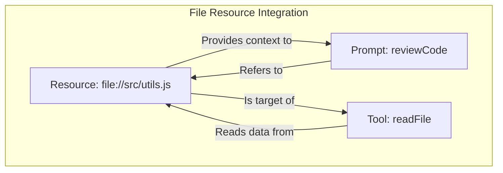
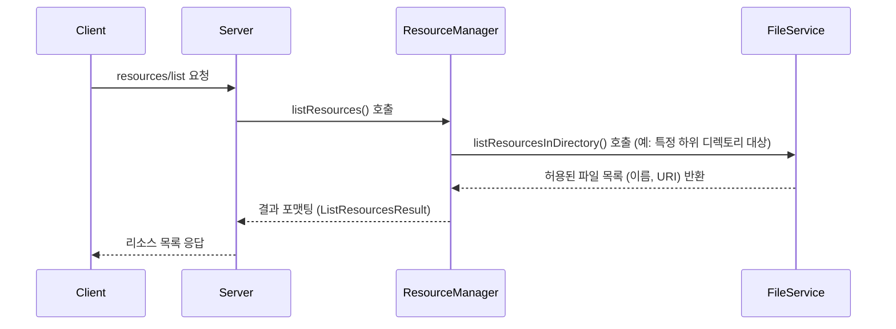

# MCP 서버 Resources 구현 상세 (파일 기반)

## 1. Resources 개요 (파일 중심)

Resources는 MCP 서버에서 LLM 또는 Prompt가 참조할 수 있는 데이터 단위를 나타냅니다. `mcp-file-server`와 같은 파일 중심 서버에서는 주로 **서버가 접근 가능한 특정 디렉토리 내의 파일들**을 리소스로 관리합니다.

### 1.1 파일 리소스의 특징

- **URI 기반 접근**: `file://` 스키마를 사용하여 서버 내 파일 경로를 표준화된 방식으로 식별합니다. (예: `file://documents/report.pdf`)
- **서버 관리 및 접근 제어**: 서버는 클라이언트로부터 받은 설정(`allowedDirectories`, `allowedExtensions`)에 따라 접근 가능한 파일의 범위(디렉토리, 확장자)를 엄격히 제어합니다. 클라이언트나 LLM은 이 제한된 범위 내의 파일만 리소스로 참조할 수 있습니다.
- **Prompt/Tool 연동**: Prompt는 파일 리소스를 컨텍스트로 참조하여 LLM에게 정보를 제공하고, Tool(예: `readFile`)은 파일 리소스를 직접 읽거나 수정할 수 있습니다.
- **정적인 컨텍스트 제공**: 주로 LLM에게 읽기 전용 컨텍스트를 제공하는 데 사용됩니다.

<Warning>
**경로 보안이 핵심:** 파일 리소스 구현 시 가장 중요한 것은 **경로 검증**입니다.
- **URI 해석 및 검증:** 클라이언트, Prompt, 또는 LLM이 제공하는 모든 `file://` URI는 서버에서 안전하게 해석되어야 합니다. `..`, 절대 경로, 심볼릭 링크 등을 이용한 Path Traversal 공격을 반드시 방지해야 합니다.
- **허용된 경로 확인:** 해석된 경로는 서버 설정 시 클라이언트가 지정한 `allowedDirectories` 내에 속하는지, 그리고 허용된 확장자(`allowedExtensions`)인지 반드시 확인해야 합니다. 허용되지 않은 경로 접근은 차단되어야 합니다.
- **최소 권한:** 리소스를 제공하는 서버 프로세스는 필요한 최소한의 파일 시스템 권한만 가져야 합니다.
</Warning>

### 1.2 파일 리소스 종류

서버 설정(`allowedExtensions`)에 따라 다양한 종류의 파일이 리소스가 될 수 있습니다:

- **텍스트 파일**: 소스 코드(`.js`, `.py`), 설정 파일(`.json`, `.yaml`), 문서(`.md`, `.txt`), 데이터(`.csv`) 등
- **바이너리 파일**: 이미지(`.png`, `.jpg`), PDF 문서 등 (서버/클라이언트가 처리 방식을 정의해야 함)

### 1.3 Resources와 다른 핵심 기능과의 통합 (파일 예시)



1.  **Tools 통합**: `readFile` Tool은 `file://src/utils.js` URI를 받아 해당 파일 리소스의 내용을 읽어 반환합니다. `writeFile` Tool은 해당 URI의 파일 내용을 수정할 수 있습니다. 이때 Tool 구현체는 내부적으로 `ResourceManager` 또는 `FileService`를 통해 경로 유효성 및 쓰기 권한을 확인해야 합니다.
2.  **Prompts 통합**: `reviewCode` Prompt는 인수로 받은 `file://src/utils.js` URI를 `messages` 내 `resource` 타입으로 포함시켜 LLM에게 코드 리뷰를 위한 컨텍스트를 제공합니다. 서버는 이 URI가 접근 가능한지 확인 후 LLM에게 전달합니다.

## 2. 파일 리소스 구현 방법

### 2.1 파일 URI 구조

- `file://{상대경로}` 형식을 사용합니다.
- 상대 경로는 서버가 `server/config` 단계에서 클라이언트로부터 받은 `allowedDirectories` 중 하나를 기준으로 합니다.
- 예시: `allowedDirectories`가 `["/path/to/workspace"]`이고, 접근하려는 파일이 `/path/to/workspace/documents/spec.md`라면, URI는 `file://documents/spec.md`가 됩니다.

### 2.2 서버 측 처리 (ResourceManager 또는 FileService)

서버는 `file://` URI를 받아 실제 파일 시스템 경로로 변환하고 접근을 제어하는 로직이 필요합니다. 이는 `ResourceManager` 또는 별도의 `FileService`에서 담당할 수 있습니다.

```typescript
import path from "path";
import fs from "fs/promises";
import { McpError, ErrorCode } from "@mcp/sdk"; // 가상 SDK

class FileService {
  private allowedDirs: string[];
  private allowedExtensions: string[];

  constructor(config: {
    allowedDirectories: string[];
    allowedExtensions: string[];
  }) {
    // 경로 정규화 및 절대 경로 변환
    this.allowedDirs = config.allowedDirectories.map((dir) =>
      path.resolve(dir)
    );
    this.allowedExtensions = config.allowedExtensions.map((ext) =>
      ext.startsWith(".") ? ext : "." + ext
    );
  }

  // URI를 안전한 절대 경로로 변환하고 검증
  private async validateAndResolvePath(relativePath: string): Promise<string> {
    // 1. 상대 경로 정규화 (악의적인 입력 제거 시도)
    const normalizedRelativePath = path.normalize(relativePath);

    // 2. 허용된 각 디렉토리에 대해 절대 경로 생성
    let resolvedPath: string | null = null;
    let isAllowed = false;
    for (const allowedDir of this.allowedDirs) {
      const potentialPath = path.resolve(allowedDir, normalizedRelativePath);

      // 3. Path Traversal 방지: 최종 경로가 허용된 디렉토리 내부에 있는지 확인
      if (
        potentialPath.startsWith(allowedDir + path.sep) ||
        potentialPath === allowedDir
      ) {
        resolvedPath = potentialPath;
        isAllowed = true;
        break; // 첫 번째 매칭되는 허용 디렉토리에서 중단
      }
    }

    // 4. 허용된 디렉토리 내 경로가 아니면 에러
    if (!resolvedPath || !isAllowed) {
      throw new McpError(
        ErrorCode.Forbidden,
        `경로 접근 거부: ${relativePath}`
      );
    }

    // 5. 파일 존재 여부 확인 (필요시)
    try {
      await fs.access(resolvedPath);
    } catch {
      throw new McpError(
        ErrorCode.NotFound,
        `파일을 찾을 수 없음: ${relativePath}`
      );
    }

    // 6. 허용된 확장자 검증
    const ext = path.extname(resolvedPath).toLowerCase();
    if (!this.allowedExtensions.includes(ext)) {
      throw new McpError(
        ErrorCode.Forbidden,
        `허용되지 않은 파일 확장자: ${ext}`
      );
    }

    return resolvedPath;
  }

  // 외부(ResourceManager, Tool 등)에서 호출하는 함수
  async readFileContent(relativePath: string): Promise<string> {
    const absolutePath = await this.validateAndResolvePath(relativePath);
    // 실제 파일 읽기 로직
    return await fs.readFile(absolutePath, "utf-8");
  }

  // Resource 목록 조회 함수 (지정된 하위 디렉토리만)
  async listResourcesInDirectory(
    subDirectory: string = ""
  ): Promise<{ name: string; uri: string }[]> {
    const relativeDirPath = path.normalize(subDirectory);
    let resourceList: { name: string; uri: string }[] = [];

    for (const allowedDir of this.allowedDirs) {
      const absoluteDirPath = path.resolve(allowedDir, relativeDirPath);

      // 디렉토리가 허용된 경로 내에 있는지 확인
      if (
        !(
          absoluteDirPath.startsWith(allowedDir + path.sep) ||
          absoluteDirPath === allowedDir
        )
      ) {
        continue; // 이 허용된 디렉토리에 대한 하위 디렉토리가 아님
      }

      try {
        const entries = await fs.readdir(absoluteDirPath, {
          withFileTypes: true,
        });
        for (const entry of entries) {
          if (entry.isFile()) {
            const filePath = path.join(relativeDirPath, entry.name);
            const fileExt = path.extname(entry.name).toLowerCase();
            if (this.allowedExtensions.includes(fileExt)) {
              const uri = `file://${filePath.replace(/\\/g, "/")}`; // URI 형식으로 변환
              resourceList.push({ name: entry.name, uri });
            }
          }
          // 필요시 하위 디렉토리 재귀 호출 로직 추가
        }
      } catch (err: any) {
        if (err.code !== "ENOENT") {
          // 디렉토리 없음 오류는 무시 가능
          console.error(`Error listing directory ${absoluteDirPath}:`, err);
        }
      }
    }
    return resourceList;
  }
}
```

**핵심 보안 로직:**

- `validateAndResolvePath` 함수는 URI에서 추출된 상대 경로를 받아 다음을 수행합니다:
  - 경로 정규화 (`path.normalize`).
  - 허용된 각 기본 디렉토리(`allowedDirs`)를 기준으로 절대 경로 생성 (`path.resolve`).
  - **Path Traversal 방지**: 생성된 절대 경로가 실제로 해당 `allowedDir` 내부에 있는지 확인 (`startsWith`).
  - 허용된 확장자(`allowedExtensions`) 검사.
- 이 검증을 통과한 경로에 대해서만 파일 시스템 작업(읽기, 쓰기 등)을 수행합니다.

## 3. 리소스 관리 (`ResourceManager`)

`ResourceManager`는 서버 내에서 접근 가능한 파일 리소스 목록을 관리하고 제공하는 역할을 합니다. 실제 파일 접근 로직은 `FileService`에 위임할 수 있습니다.

### 3.1 리소스 목록 제공 (`resources/list` 구현)



```typescript
import { FileService } from "./fileService";
import { ListResourcesResult } from "@mcp/sdk"; // 가상 SDK

class ResourceManager {
  constructor(private fileService: FileService) {}

  async listResources(): Promise<ListResourcesResult> {
    // 예시: 'resources' 하위 디렉토리의 파일만 리소스로 간주
    try {
      // FileService를 통해 안전하게 파일 목록 조회
      const files = await this.fileService.listResourcesInDirectory(
        "resources"
      );
      return { resources: files };
    } catch (error: any) {
      console.error("Failed to list resources:", error);
      // 실제 구현에서는 McpError를 throw 해야 함
      throw new McpError(
        ErrorCode.InternalError,
        `리소스 목록 조회 실패: ${error.message}`
      );
    }
  }

  // 필요시 특정 URI의 유효성 검증 함수 추가
  async validateResourceAccess(uri: string): Promise<void> {
    if (!uri.startsWith("file://")) {
      throw new McpError(
        ErrorCode.InvalidParams,
        `잘못된 리소스 URI 스키마: ${uri}`
      );
    }
    const relativePath = uri.substring("file://".length);
    // FileService의 검증 함수 호출 (읽기 함수 등을 호출하여 존재 및 접근 가능 여부 확인)
    await this.fileService.validateAndResolvePath(relativePath);
  }
}
```

- `resources/list` 요청을 받으면, `ResourceManager`는 `FileService`를 호출하여 설정된 `allowedDirectories` 내의 특정 하위 디렉토리(예: `resources`)에 있는 파일 중 허용된 확장자를 가진 파일 목록을 조회합니다.
- 결과를 `file://` URI 형식으로 변환하여 클라이언트에게 반환합니다.
- `PromptManager`나 `ToolManager`는 리소스 URI를 사용할 때 `ResourceManager`의 `validateResourceAccess` 같은 함수를 호출하여 해당 URI가 현재 서버 설정 하에서 유효하고 접근 가능한지 확인할 수 있습니다.

## 4. 에러 처리 및 보안

- **오류 코드:** 파일 리소스 관련 오류 발생 시 표준 MCP 오류 코드를 사용합니다.
  - `ErrorCode.NotFound (-32601)`: URI에 해당하는 파일을 찾을 수 없음.
  - `ErrorCode.Forbidden (-32000)`: 경로가 `allowedDirectories` 외부에 있거나, `allowedExtensions`가 아님.
  - `ErrorCode.InvalidParams (-32602)`: URI 형식이 잘못됨.
  - `ErrorCode.InternalError (-32603)`: 파일 시스템 읽기/쓰기 중 예상치 못한 오류 발생.
- **로깅:** 모든 리소스 접근 시도(성공 및 실패)와 관련 오류는 상세히 로깅하여 추적 가능해야 합니다.

## 5. 다음 단계

- **FileService 상세 구현:** `writeFile`, `createDirectory`, `deleteFile` 등 다른 파일 작업에 대한 검증 및 실행 로직 구현.
- **Tool 연동:** `readFile`, `writeFile` 등의 Tool 구현체에서 `FileService`를 사용하여 안전하게 파일 작업 수행.
- **Prompt 연동:** `PromptManager`에서 `ResourceManager` 또는 `FileService`를 사용하여 `resource` 타입 컨텐츠의 URI 검증 로직 구현.
