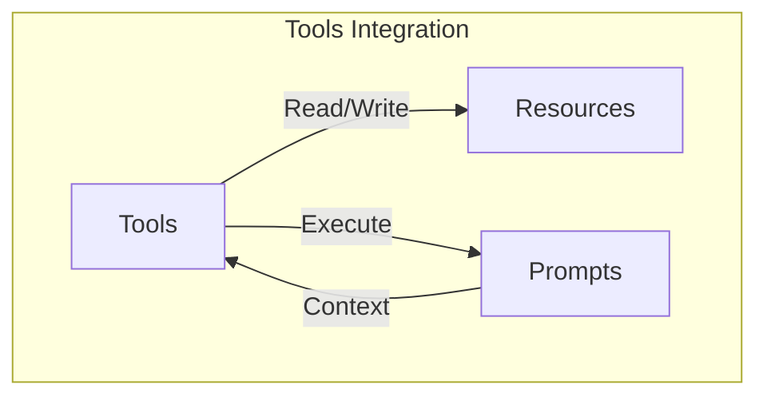
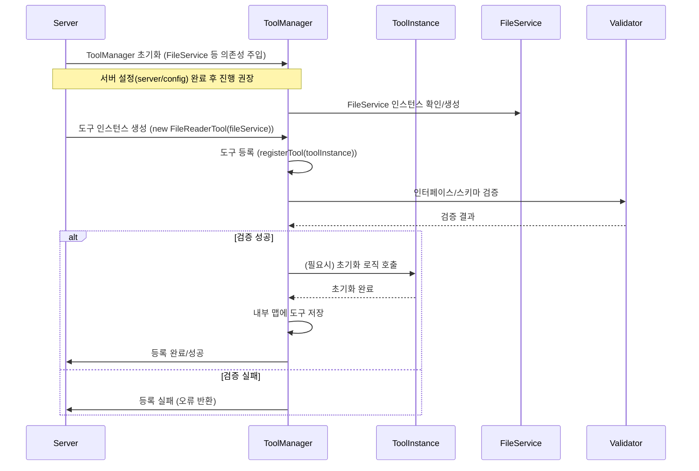
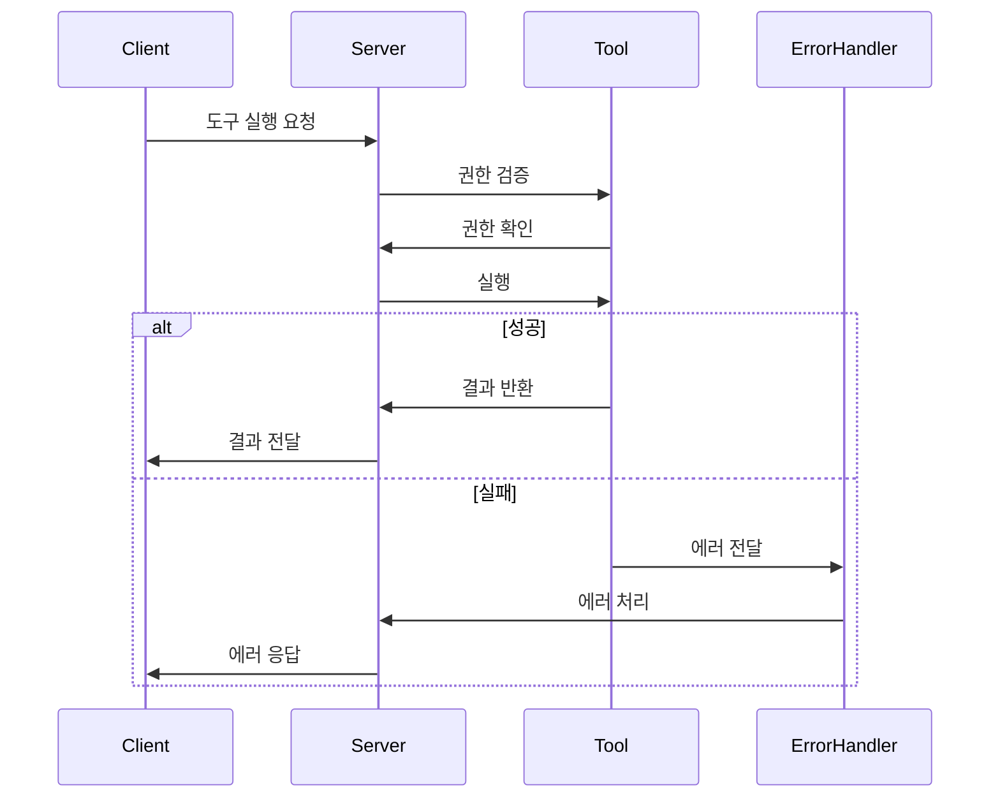

# MCP 서버 Tools 구현 상세

## 1. Tools 개요

Tools는 MCP 서버의 핵심 기능 중 하나로, LLM이 호출할 수 있는 함수들의 집합입니다. 각 도구는 독립적인 기능 단위로 구현되며, 명확한 인터페이스를 통해 LLM과 상호작용합니다.

### 1.1 도구의 특징

- **Model-Controlled**: AI 모델이 자동으로 호출할 수 있도록 설계
- **독립성**: 각 도구는 독립적으로 동작
- **재사용성**: 여러 컨텍스트에서 재사용 가능
- **확장성**: 새로운 도구를 쉽게 추가 가능
- **보안성**: 접근 제어와 권한 검증 지원 (예: 파일 시스템 접근 시 `allowedDirectories` 확인)

<Warning>
보안과 신뢰성을 위해 항상 인간의 승인이 필요합니다. 구현 시 다음 사항을 고려해야 합니다:
- AI 모델에 노출되는 도구를 명확히 표시
- 도구 호출 시 시각적 표시 제공
- 작업 수행 전 사용자 확인 프롬프트 표시
- **파일 시스템 접근 도구:** 특히 파일/디렉토리 경로를 다루는 도구는 `mcp-file-server`의 `FileService`와 같이 강력한 경로 검증 로직(Path Traversal 방지, `allowedDirectories`, `allowedExtensions` 확인)을 반드시 포함해야 합니다. 직접적인 `fs` 모듈 사용은 보안 위험을 초래할 수 있습니다.
</Warning>

### 1.2 도구의 종류

1. **시스템 작업 도구**

   - 명령어 실행
   - 파일 시스템 작업
   - 프로세스 관리

2. **API 통합 도구**

   - HTTP 요청
   - 웹소켓 통신
   - 외부 서비스 연동

3. **데이터 처리 도구**

   - 데이터 변환
   - 분석
   - 검증

4. **사용자 인터랙션 도구**
   - 알림
   - 대화
   - 피드백

### 1.3 Tools와 다른 핵심 기능과의 통합



Tools는 다음과 같은 방식으로 다른 핵심 기능과 통합됩니다:

1. **Resources 통합**

   - Resources의 데이터를 읽고 처리
   - 처리 결과를 Resources에 저장
   - 데이터 접근 시 권한 검증

2. **Prompts 통합**
   - Prompts의 컨텍스트를 활용
   - 실행 결과를 Prompts에 반영
   - 사용자 승인 프로세스 포함

## 2. 도구 구현 방법

### 2.1 기본 인터페이스

```typescript
interface Tool {
  // 도구 식별자
  name: string;

  // 도구 설명
  description: string;

  // 입력 스키마 (JSON Schema)
  inputSchema: {
    type: "object";
    properties: Record<string, SchemaProperty>;
    required?: string[];
  };

  // 도구 동작 힌트
  annotations?: {
    title?: string;
    readOnlyHint?: boolean; // 환경을 수정하지 않음
    destructiveHint?: boolean; // 파괴적 업데이트 가능
    idempotentHint?: boolean; // 동일 인자로 반복 호출해도 추가 효과 없음
    openWorldHint?: boolean; // 외부 엔티티와 상호작용
  };

  // 실행 함수
  execute: (params: any) => Promise<ToolResult>;

  // 권한 요구사항
  permissions?: Permission[];
}

interface SchemaProperty {
  type: string;
  description?: string;
  enum?: string[];
  items?: SchemaProperty;
  // 기타 JSON Schema 속성들
}

interface ToolResult {
  content: Array<TextContent | ImageContent | AudioContent | ResourceContent>;
  isError: boolean;
}

interface TextContent {
  type: "text";
  text: string;
}

interface ImageContent {
  type: "image";
  data: string; // base64 인코딩
  mimeType: string;
}

interface AudioContent {
  type: "audio";
  data: string; // base64 인코딩
  mimeType: string;
}

interface ResourceContent {
  type: "resource";
  resource: {
    uri: string;
    mimeType: string;
    text?: string;
    blob?: string;
  };
}
```

### 2.2 도구 구현 예시

```typescript
// 가상의 FileService import
import { FileService } from "./fileService"; // 실제 경로에 맞게 조정 필요
import { McpError, ErrorCode, Tool, ToolResult, TextContent } from "@mcp/sdk"; // 가상 SDK

class FileReaderTool implements Tool {
  name = "file-reader";
  description = "허용된 경로의 파일 내용을 읽는 도구";
  inputSchema = {
    type: "object",
    properties: {
      // URI 또는 상대 경로를 받을 수 있음 (예: file://documents/report.txt 또는 documents/report.txt)
      // 내부적으로 FileService가 처리
      path: {
        type: "string",
        description: "읽을 파일의 상대 경로 (allowedDirectories 기준)",
      },
      // 인코딩은 FileService 내부에서 처리하거나, 필요시 파라미터로 받을 수 있음
      // encoding: {
      //   type: "string",
      //   description: "파일 인코딩",
      //   enum: ["utf-8", "ascii"], // FileService가 지원하는 인코딩
      //   default: "utf-8"
      // },
    },
    required: ["path"],
  };
  annotations = {
    readOnlyHint: true,
    // 파일 시스템 접근은 항상 외부 세계 상호작용으로 간주
    openWorldHint: true,
  };

  // FileService 인스턴스를 생성자 또는 다른 방식으로 주입받아야 함
  constructor(private fileService: FileService) {}

  async execute(params: {
    path: string /* encoding?: string */;
  }): Promise<ToolResult> {
    try {
      // FileService를 통해 안전하게 파일 내용 읽기
      const content = await this.fileService.readFileContent(params.path);

      return {
        content: [
          {
            type: "text",
            text: content,
          },
        ],
        isError: false,
      };
    } catch (error: any) {
      // FileService에서 발생한 McpError를 그대로 반환하거나,
      // Tool 실행 관련 특정 에러로 변환하여 반환할 수 있음
      if (error instanceof McpError) {
        throw error; // McpError는 그대로 전달
      }
      // 그 외 예상치 못한 에러
      console.error(`[${this.name}] Error executing tool:`, error);
      throw new McpError(
        ErrorCode.InternalError,
        `[${this.name}] 파일 읽기 실패: ${error.message || "알 수 없는 오류"}`,
        { toolName: this.name }
      );
    }
  }
}
```

## 3. 도구 등록 및 관리

### 3.1 도구 등록 프로세스



<Info>
**초기화 순서:** Tool 및 관련 Manager(ToolManager, ResourceManager 등)는 필요한 서비스(예: `FileService`)가 초기화된 **후에** 등록 및 설정되어야 합니다. 일반적으로 서버 설정(`server/config`) 핸들러 내에서 관련 Manager와 Service를 초기화하고, 그 다음에 Tool 핸들러를 설정하는 것이 안전합니다.
</Info>

### 3.2 도구 관리자 구현 (`ToolManager`)

```typescript
// 가상 SDK 및 서비스 import
import { McpError, ErrorCode, Tool, ToolResult } from "@mcp/sdk";
import { FileService } from "./fileService"; // 가상 FileService
import Ajv from "ajv"; // JSON Schema 검증 라이브러리 예시

class ToolManager {
  private tools: Map<string, Tool> = new Map();
  private ajv = new Ajv(); // 스키마 검증기 인스턴스
  // 필요한 서비스(예: FileService)를 주입받음
  constructor(private fileService: FileService) {}

  // 도구 인스턴스를 받아 등록
  async registerTool(toolInstance: Tool): Promise<void> {
    if (this.tools.has(toolInstance.name)) {
      throw new McpError(
        ErrorCode.InternalError, // 또는 다른 적절한 에러 코드
        `Tool ${toolInstance.name} already registered.`
      );
    }

    // 인터페이스 및 스키마 검증
    this.validateToolSchema(toolInstance);

    this.tools.set(toolInstance.name, toolInstance);
    console.log(`Tool registered: ${toolInstance.name}`);
    // 구독자 알림 로직은 필요에 따라 추가
  }

  // 도구 스키마 검증
  private validateToolSchema(tool: Tool): void {
    if (!tool.name || !tool.description || !tool.inputSchema || !tool.execute) {
      throw new McpError(
        ErrorCode.InternalError,
        `Tool ${
          tool.name || "Unnamed"
        } is missing required properties (name, description, inputSchema, execute).`
      );
    }
    try {
      this.ajv.compile(tool.inputSchema); // 스키마 컴파일 시도
    } catch (error: any) {
      throw new McpError(
        ErrorCode.InternalError,
        `Invalid input schema for tool ${tool.name}: ${error.message}`
      );
    }
    // 추가적인 검증 로직 (예: 함수 타입 확인 등)
  }

  // 도구 목록 조회
  listTools(): Tool[] {
    return Array.from(this.tools.values());
  }

  // 도구 이름으로 조회
  getTool(name: string): Tool | undefined {
    return this.tools.get(name);
  }

  // 도구 실행 (권한 검증 후)
  async executeTool(name: string, params: any): Promise<ToolResult> {
    const tool = this.getTool(name);
    if (!tool) {
      throw new McpError(ErrorCode.NotFound, `Tool not found: ${name}`);
    }

    // 입력 파라미터 스키마 검증
    const validate = this.ajv.compile(tool.inputSchema);
    if (!validate(params)) {
      throw new McpError(
        ErrorCode.InvalidParams,
        `Invalid parameters for tool ${name}: ${this.ajv.errorsText(
          validate.errors
        )}`,
        { toolName: name, validationErrors: validate.errors }
      );
    }

    // 실제 도구 실행 (에러는 도구의 execute 메서드 또는 여기서 catch하여 처리)
    try {
      // 여기서 추가적인 권한 검증 로직 수행 가능
      // 예: if (!this.checkPermissions(tool, context)) throw ...

      // FileService와 같은 의존성이 Tool 인스턴스 내부에 주입되어 있어야 함
      return await tool.execute(params);
    } catch (error: any) {
      if (error instanceof McpError) {
        throw error; // 이미 처리된 McpError는 그대로 전달
      }
      console.error(`Error executing tool ${name}:`, error);
      throw new McpError(
        ErrorCode.InternalError,
        `Tool execution failed for ${name}: ${
          error.message || "Unknown error"
        }`,
        { toolName: name }
      );
    }
  }

  // ... (구독자 관리 및 알림 메서드는 필요시 구현) ...
}
```

## 4. 도구 실행 및 에러 처리

### 4.1 실행 프로세스



### 4.2 에러 처리

- 도구 실행 중 발생하는 모든 오류는 표준 `McpError` 객체를 사용하여 처리하고 반환하는 것을 권장합니다.
- `McpError`는 `code` (표준 에러 코드), `message` (오류 설명), `data` (추가 정보) 필드를 포함합니다.
- 도구 구현 시 `try...catch` 블록을 사용하여 예상되는 오류(예: 파일 없음, 네트워크 오류, 잘못된 입력)를 명시적으로 처리하고 적절한 `McpError`를 생성해야 합니다.
- 예상치 못한 오류는 `ErrorCode.InternalError` (-32603) 코드를 사용하여 보고합니다.

```typescript
// 표준 에러 코드 사용 예시 (mcp/sdk 내에 정의되어 있다고 가정)
import { McpError, ErrorCode } from "@mcp/sdk";

async function someToolExecute(params: any) {
  try {
    if (!params.requiredField) {
      // 잘못된 파라미터 오류
      throw new McpError(
        ErrorCode.InvalidParams, // -32602
        "Missing required parameter: requiredField",
        { toolName: "someTool" }
      );
    }

    const result = await performPotentiallyFailingOperation(
      params.requiredField
    );
    if (!result) {
      // 작업 실패 (예: 외부 API 호출 실패)
      throw new McpError(
        ErrorCode.InternalError, // -32603 또는 더 구체적인 코드
        "Operation failed: External service returned an error",
        { toolName: "someTool", externalErrorCode: 500 }
      );
    }
    // 성공 시 결과 반환
    return { content: [{ type: "text", text: "Success" }], isError: false };
  } catch (error: any) {
    if (error instanceof McpError) {
      // 이미 McpError인 경우 그대로 throw
      throw error;
    } else if (error.code === "ENOENT") {
      // 파일 시스템 관련 특정 오류 처리 예시
      throw new McpError(
        ErrorCode.NotFound, // -32601 (Method not found지만, 리소스 없음 의미로 사용 가능) 또는 커스텀 코드
        `File not found for parameter: ${params.requiredField}`,
        { toolName: "someTool" }
      );
    } else {
      // 기타 예상치 못한 오류
      console.error(`[someTool] Unexpected error:`, error);
      throw new McpError(
        ErrorCode.InternalError, // -32603
        `Unexpected error during tool execution: ${
          error.message || "Unknown error"
        }`,
        { toolName: "someTool" }
      );
    }
  }
}
```

## 5. 도구 테스트

### 5.1 단위 테스트

```typescript
describe("FileReaderTool", () => {
  let tool: FileReaderTool;
  // Mock FileService 생성
  const mockFileService: jest.Mocked<FileService> = {
    readFileContent: jest.fn(),
    // FileService의 다른 메서드들도 필요에 따라 mock 처리
    validateAndResolvePath: jest.fn(),
    listResourcesInDirectory: jest.fn(),
    writeFileContent: jest.fn(), // 예시
    createDirectory: jest.fn(), // 예시
  };

  beforeEach(() => {
    // Mock을 초기화하고 Tool 인스턴스 생성 시 주입
    jest.clearAllMocks();
    tool = new FileReaderTool(mockFileService);
  });

  it("should read file content using FileService", async () => {
    const filePath = "test.txt";
    const fileContent = "Hello, world!";
    // FileService의 readFileContent가 특정 내용을 반환하도록 설정
    mockFileService.readFileContent.mockResolvedValue(fileContent);

    const result = await tool.execute({ path: filePath });

    expect(result.isError).toBe(false);
    expect(result.content[0].type).toBe("text");
    expect((result.content[0] as TextContent).text).toBe(fileContent);
    // FileService의 함수가 올바른 인자로 호출되었는지 확인
    expect(mockFileService.readFileContent).toHaveBeenCalledWith(filePath);
  });

  it("should handle error from FileService (e.g., file not found)", async () => {
    const filePath = "nonexistent.txt";
    const error = new McpError(
      ErrorCode.NotFound,
      `File not found: ${filePath}`
    );
    // FileService가 에러를 throw하도록 설정
    mockFileService.readFileContent.mockRejectedValue(error);

    // Tool 실행 시 에러가 발생하는지 확인
    await expect(tool.execute({ path: filePath })).rejects.toThrow(error);
    // FileService 함수가 호출되었는지 확인
    expect(mockFileService.readFileContent).toHaveBeenCalledWith(filePath);
  });

  // 입력 파라미터 검증 실패 케이스 (ToolManager 레벨에서 처리될 수 있음)
  // it("should throw InvalidParams if required params are missing", async () => {
  //   // ToolManager의 executeTool을 테스트하는 것이 더 적합할 수 있음
  // });
});
```

### 5.2 통합 테스트

```typescript
// ToolManager 통합 테스트 예시
describe("ToolManager Integration", () => {
  let toolManager: ToolManager;
  let fileService: FileService; // 실제 또는 Mock FileService

  beforeEach(() => {
    // 실제 FileService 설정 (테스트 환경용 경로 사용)
    fileService = new FileService({
      allowedDirectories: ["./test-workspace/allowed"], // 테스트용 허용 디렉토리
      allowedExtensions: [".txt", ".js"], // 테스트용 허용 확장자
    });
    // ToolManager 생성 및 FileService 주입
    toolManager = new ToolManager(fileService);

    // 테스트에 필요한 파일/디렉토리 설정 (예: test-workspace/allowed/test.txt 생성)
    // fs.mkdirSync("./test-workspace/allowed", { recursive: true });
    // fs.writeFileSync("./test-workspace/allowed/test.txt", "integration test content");
  });

  afterEach(() => {
    // 테스트 후 생성된 파일/디렉토리 정리
    // fs.rmSync("./test-workspace", { recursive: true, force: true });
  });

  it("should register tool and execute it via manager", async () => {
    // FileReaderTool 인스턴스 생성 시 실제 FileService 주입
    const tool = new FileReaderTool(fileService);
    await toolManager.registerTool(tool);

    // ToolManager를 통해 도구 실행
    const result = await toolManager.executeTool("file-reader", {
      path: "test.txt", // allowedDirectories 기준 상대 경로
    });

    expect(result.isError).toBe(false);
    expect(result.content[0].type).toBe("text");
    // expect((result.content[0] as TextContent).text).toBe("integration test content"); // 실제 파일 내용 검증
  });

  it("should return NotFound error for unregistered tool", async () => {
    await expect(toolManager.executeTool("unknown-tool", {})).rejects.toThrow(
      new McpError(ErrorCode.NotFound, "Tool not found: unknown-tool")
    );
  });

  it("should return InvalidParams error for invalid parameters", async () => {
    const tool = new FileReaderTool(fileService);
    await toolManager.registerTool(tool);

    // 'path' 파라미터 누락
    await expect(toolManager.executeTool("file-reader", {})).rejects.toThrow(
      expect.objectContaining({ code: ErrorCode.InvalidParams })
    );
  });

  it("should handle FileService errors (e.g., path forbidden)", async () => {
    const tool = new FileReaderTool(fileService);
    await toolManager.registerTool(tool);

    // 허용되지 않은 경로 접근 시도 (allowedDirectories 외부)
    await expect(
      toolManager.executeTool("file-reader", { path: "../forbidden.txt" })
    ).rejects.toThrow(expect.objectContaining({ code: ErrorCode.Forbidden }));

    // 허용되지 않은 확장자 접근 시도
    // fs.writeFileSync("./test-workspace/allowed/image.png", "dummy"); // 테스트용 파일 생성
    // await expect(
    //   toolManager.executeTool("file-reader", { path: "image.png" })
    // ).rejects.toThrow(expect.objectContaining({ code: ErrorCode.Forbidden }));
  });
});
```

## 6. 보안 고려사항

### 6.1 접근 제어

- 도구별 권한 설정
- 실행 컨텍스트 검증
- 리소스 접근 제한
- 도구 어노테이션 신뢰성 검증

### 6.2 입력 검증

- **JSON Schema 기반 파라미터 검증:** `ToolManager` 등에서 도구 실행 전 반드시 입력 파라미터가 정의된 스키마를 만족하는지 검증합니다. (필수 필드, 타입, 형식 등)
- **파일 경로 및 시스템 명령어 살균/검증:**
  - 파일 시스템에 접근하는 도구는 입력받은 경로 문자열을 **반드시 정규화하고 검증**해야 합니다. (`path.normalize`, `path.resolve` 사용)
  - **Path Traversal 공격 방지:** 정규화된 경로가 설정된 `allowedDirectories` 내부에 있는지 `startsWith` 등으로 **반드시 확인**해야 합니다. `..` 등을 이용한 상위 디렉토리 접근 시도를 차단해야 합니다.
  - 허용된 확장자(`allowedExtensions`)인지 확인합니다.
  - 시스템 명령어를 실행하는 도구는 입력값을 셸에 직접 전달하지 않고, 안전한 API를 사용하거나 입력을 엄격하게 이스케이프/검증해야 합니다. **명령어 주입(Command Injection) 취약점에 극도로 주의**해야 합니다.
- **URL 및 외부 식별자 검증:** 외부 리소스에 접근하는 도구는 URL 형식이 올바른지, 예상된 도메인인지 등을 검증해야 합니다. SSRF(Server-Side Request Forgery) 공격에 유의해야 합니다.
- **매개변수 크기 및 범위 검사:** 비정상적으로 크거나 작은 입력값, 또는 예상 범위를 벗어나는 숫자 등을 검증하여 서비스 거부(DoS) 공격이나 예상치 못한 동작을 방지합니다.
- **구체적인 위험 방지:**
  - **Command Injection:** 사용자 입력을 셸 명령어에 직접 삽입하지 마십시오.
  - **Path Traversal:** 사용자 제공 경로가 허용된 기본 디렉토리를 벗어나지 못하도록 엄격히 검증하십시오.
  - **SSRF:** 사용자가 제공한 URL로 서버가 임의의 요청을 보내지 않도록 URL 스키마, 호스트, 포트를 검증하십시오.
  - **Denial of Service (DoS):** 입력 크기, 처리 시간, 리소스 사용량 등을 제한하십시오.
  - **Data Leakage:** 오류 메시지나 로깅에 민감한 정보가 포함되지 않도록 주의하십시오.

### 6.3 감사 로깅

- 도구 실행 기록
- 에러 로깅
- 성능 모니터링
- 보안 관련 이벤트 추적

## 7. 성능 최적화

### 7.1 캐싱 전략

- 결과 캐싱
- 리소스 풀링
- 연결 재사용
- 타임아웃 관리

### 7.2 비동기 처리

- Promise 기반 실행
- 병렬 처리
- 진행 상황 보고
- 리소스 정리

## 8. 다음 단계

이 문서를 통해 Tools 구현 방법을 이해했다면, 다음 문서들을 통해 더 자세한 내용을 학습할 수 있습니다:

1. [Resources 구현 상세](resources.md)

   - 리소스 관리
   - 캐싱 전략
   - 동기화 메커니즘

2. [Prompts 구현 상세](prompts.md)

   - 템플릿 설계
   - 변수 처리
   - 다국어 지원

3. [성능 최적화 가이드](../03-optimization.md)
   - 도구 성능 최적화
   - 비동기 처리
   - 모니터링 설정
