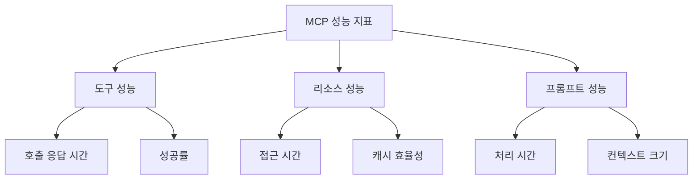

# MCP 서버 성능 최적화 가이드

## 1. 성능 최적화 개요

MCP 서버의 성능을 최적화하기 위한 전략과 기법을 설명합니다. 이 가이드는 MCP 스펙에 정의된 기능들을 기반으로 성능을 개선하는 방법을 다룹니다.

### 1.1 성능 최적화의 목표

- **응답 시간**: 도구 호출 및 리소스 접근 시간 단축
- **처리량**: 단위 시간당 처리 가능한 요청 수 증가
- **리소스 효율성**: 리소스 캐싱 및 접근 제어 최적화
- **안정성**: 오류 처리 및 타임아웃 관리

### 1.2 MCP 성능 측정 지표

## 2. 도구 최적화

### 2.1 도구 호출 최적화

- **비동기 처리 활용**: 도구 실행은 기본적으로 비동기(Promise 기반)로 처리되어야 합니다. 이는 서버가 다른 요청을 처리하는 동안 I/O 작업(파일 읽기/쓰기, 네트워크 요청 등)이 백그라운드에서 수행되도록 하여 전체 처리량을 높입니다.
- **효율적인 데이터 처리**: 도구 내부 로직에서 대용량 데이터를 처리할 경우, 스트리밍이나 청크 단위 처리를 고려하여 메모리 사용량을 최적화합니다.
- **외부 API 호출 최적화**:
  - **타임아웃 설정**: 외부 API 호출 시 적절한 타임아웃을 설정하여 무한정 대기하는 상황을 방지합니다. SDK 또는 HTTP 클라이언트 라이브러리에서 제공하는 타임아웃 설정을 활용합니다.
  - **Connection Pooling**: 외부 서비스와 자주 통신하는 경우, HTTP 연결 풀을 사용하여 연결 설정 오버헤드를 줄입니다.
  - **재시도 로직**: 일시적인 네트워크 오류에 대비하여 적절한 재시도 로직(Exponential Backoff 등)을 구현합니다.
- **파일 시스템 접근 도구 (`mcp-file-server` 등)**:
  - **경로 검증 효율화**: `FileService` 등에서 수행하는 경로 검증 로직(`allowedDirectories`, `allowedExtensions` 확인, Path Traversal 방지)이 빈번하게 호출될 경우, 검증 로직 자체의 성능을 점검하고 최적화합니다. 예를 들어, 정규화된 허용 경로 목록을 미리 계산해두고 비교하는 방식을 사용할 수 있습니다.
  - **불필요한 파일 I/O 최소화**: 꼭 필요한 경우에만 파일을 읽거나 쓰도록 설계합니다. 예를 들어, 메타데이터만 필요한 경우 전체 파일을 읽지 않도록 합니다.

### 2.2 도구 성능 관리

- **타임아웃 관리**:
  - **도구별 타임아웃**: 각 도구의 특성에 맞는 개별 타임아웃을 설정하는 것을 고려합니다. (예: 간단한 정보 조회 도구 vs. 복잡한 처리 도구)
  - **장시간 실행 도구 모니터링**: 로그를 통해 평균 실행 시간을 모니터링하고, 비정상적으로 오래 실행되는 도구를 식별하여 원인을 분석합니다.
  - **타임아웃 발생 시 적절한 오류 처리**: 타임아웃 발생 시 클라이언트에게 명확한 오류(`McpError` 사용, 예: `ErrorCode.Timeout`)를 반환하고, 필요한 경우 보상 트랜잭션을 수행합니다.
- **결과 검증**: 도구 실행 결과가 예상된 스키마를 따르는지, 그리고 내용이 유효한지 서버 측에서 검증하는 로직을 추가할 수 있습니다. 이는 LLM의 오작동이나 잘못된 입력을 조기에 발견하는 데 도움이 됩니다.
- **병렬 처리 주의**: 여러 도구를 동시에 실행할 수 있는 경우, 시스템 리소스(CPU, 메모리, 네트워크 대역폭) 한계를 고려하여 병렬 실행 수를 제한하는 메커니즘(예: 세마포어, 작업 큐)을 도입할 수 있습니다.

## 3. 리소스 최적화

### 3.1 리소스 접근 제어 및 유효성 검증

- **효율적인 경로 검증**: `FileService`의 `validateAndResolvePath`와 같은 함수는 리소스 접근의 핵심 보안 요소이자 성능에 영향을 줄 수 있습니다.
  - 문자열 연산, 정규식 사용 최적화.
  - 미리 계산된 정규화된 `allowedDirectories` 목록을 사용하여 비교 연산 줄이기.
- **권한 캐싱 (주의 필요)**: 리소스에 대한 접근 권한이 자주 변경되지 않는다면, 검증된 권한 결과를 단기간 캐싱하는 것을 고려할 수 있습니다. 단, 권한 변경 시 캐시를 즉시 무효화하는 로직이 필수적이며, 보안상 신중하게 접근해야 합니다.
- **요청당 검증 최소화**: 가능한 경우, 단일 요청 내에서 동일 리소스에 대한 반복적인 경로/권한 검증을 피하도록 로직을 구성합니다.

### 3.2 리소스 캐싱 (`mcp-file-server` 등 파일 기반 서버)

- **캐싱 전략**:
  - **자주 접근하는 파일 캐싱**: `GET` 요청이 빈번한 작은 크기의 설정 파일, 템플릿 파일 등을 메모리(예: LRU 캐시)에 캐싱하여 디스크 I/O를 줄입니다. `mcp-file-server`에서는 `prompt/get` 요청 시 JSON 파일을 읽어오므로, 이러한 파일들이 캐싱 대상이 될 수 있습니다.
  - **캐시 대상**: 파일 내용 전체 또는 자주 사용되는 파싱된 결과(예: JSON 객체)를 캐싱할 수 있습니다.
  - **캐시 무효화 정책**: 원본 파일 변경 시 캐시를 자동으로 무효화하는 메커니즘이 중요합니다. 파일 시스템 이벤트를 감시하거나(예: `fs.watch`), 주기적으로 파일의 `mtime` (수정 시간)을 확인하여 변경 여부를 감지할 수 있습니다.
  - **캐시 크기 관리**: 메모리 캐시 사용 시 최대 크기를 제한하여 메모리 고갈을 방지합니다. LRU(Least Recently Used)와 같은 정책으로 오래된 캐시를 제거합니다.
  - **HTTP 캐싱 헤더 활용**: 클라이언트가 리소스를 효율적으로 캐싱할 수 있도록 `ETag`, `Last-Modified`, `Cache-Control` 같은 HTTP 헤더를 응답에 포함시키는 것을 고려합니다 (만약 서버가 HTTP 기반 통신을 지원한다면).
- **캐싱 시 보안 고려사항**:
  - 캐시된 데이터에 민감한 정보가 포함되지 않도록 주의합니다.
  - 사용자별로 접근 권한이 다른 리소스의 경우, 캐시 키에 사용자 식별 정보를 포함하거나 캐싱을 적용하지 않아야 합니다.

## 4. 프롬프트 최적화

### 4.1 컨텍스트 관리 (LLM 연동 시)

- **컨텍스트 크기 제한**: LLM에 전달되는 프롬프트의 전체 토큰(Token) 수를 제한하여 비용 및 응답 시간을 관리합니다. 이는 LLM 모델 자체의 최대 컨텍스트 길이를 고려해야 합니다.
- **정보 요약 및 필터링**: 프롬프트에 포함되는 리소스(`file://` URI로 참조된 파일 내용 등)나 대화 기록이 너무 길 경우, LLM에 전달하기 전에 요약하거나 관련 없는 부분을 필터링하는 전처리 단계를 고려할 수 있습니다.
- **관련성 높은 리소스 선택**: 사용자의 현재 의도와 가장 관련 높은 리소스를 선택하여 프롬프트에 포함시킵니다. (예: Semantic Search 활용)
- **프롬프트 템플릿 최적화**: 프롬프트 템플릿 자체를 간결하고 명확하게 구성하여 LLM이 의도를 더 잘 파악하고 불필요한 토큰 생성을 줄이도록 합니다.

### 4.2 프롬프트 처리 (`mcp-file-server` 등 파일 기반 서버)

- **템플릿 파일 로딩**: `prompt/get`과 같이 프롬프트 템플릿을 파일에서 읽어오는 경우, 위에서 언급된 파일 리소스 캐싱 전략을 적용하여 디스크 I/O를 줄일 수 있습니다.
- **변수 치환 효율성**: 프롬프트 템플릿 내 변수를 실제 값으로 치환하는 로직의 성능을 고려합니다. 복잡한 문자열 연산보다는 효율적인 템플릿 엔진이나 파싱 로직을 사용합니다.
- **프롬프트 처리 로직**: `PromptManager` 내부에서 프롬프트를 로드하고, 파싱하고, 컨텍스트를 채우는 과정에서의 불필요한 연산을 최소화합니다.
- **사전 유효성 검사**: LLM에 전달하기 전에 프롬프트에 필요한 모든 인수가 제대로 제공되었는지, 리소스 URI가 유효한지 등을 검증하여 오류를 조기에 발견합니다.

## 5. 로깅 및 모니터링

### 5.1 MCP 로깅 시스템 활용

- **구체적인 로그 메시지**: `mcp-file-server`와 같은 서버에서는 어떤 도구가 호출되었는지, 어떤 파일에 접근했는지, 어떤 프롬프트가 사용되었는지 등 구체적인 정보를 로그에 남기는 것이 디버깅 및 성능 분석에 유용합니다.
  - 예: `[ToolManager] Executing tool 'file-reader' with params: { path: 'data/input.txt' }`
  - 예: `[FileService] Reading file: /app/allowed_dir/data/input.txt`
  - 예: `[PromptManager] Loaded prompt 'code-review' for request.`
- **실행 시간 로깅**: 주요 작업(도구 실행, 파일 I/O, 프롬프트 처리)의 시작과 끝에 로그를 남겨 실행 시간을 측정하고 병목 지점을 파악합니다.
  - 예: `[FileReaderTool] Started execution for path: 'input.txt'`
  - 예: `[FileReaderTool] Finished execution for path: 'input.txt'. Duration: 15ms`
- **에러 로깅 상세화**: 오류 발생 시 스택 트레이스뿐만 아니라, 오류 발생 당시의 주요 파라미터나 상태 정보를 함께 로깅하여 원인 분석을 용이하게 합니다.

### 5.2 로그 레벨 및 사용

MCP는 RFC 5424 기반의 표준 로그 레벨을 사용합니다:

| 레벨      | 설명             | 사용 사례             |
| --------- | ---------------- | --------------------- |
| debug     | 상세 디버깅 정보 | 함수 진입/종료 지점   |
| info      | 일반 정보 메시지 | 작업 진행 상황        |
| notice    | 중요 일반 이벤트 | 설정 변경             |
| warning   | 경고 조건        | 사용 중단 기능 사용   |
| error     | 오류 조건        | 작업 실패             |
| critical  | 심각한 조건      | 시스템 구성 요소 실패 |
| alert     | 즉시 조치 필요   | 데이터 손상 감지      |
| emergency | 시스템 사용 불가 | 전체 시스템 실패      |

### 5.3 성능 모니터링

- **핵심 성능 지표 (KPIs)**:
  - **요청 처리 시간 (End-to-End Latency)**: 클라이언트 요청 수신부터 응답 전송까지의 전체 시간.
  - **도구별 실행 시간**: 각 도구의 평균/최대 실행 시간.
  - **리소스 접근 시간**: 파일 읽기/쓰기, `FileService`의 경로 검증 함수 등의 평균/최대 실행 시간.
  - **프롬프트 처리 시간**: 프롬프트 로딩, 렌더링 시간.
  - **처리량 (Throughput)**: 단위 시간당 처리하는 요청 수 (예: 초당 요청 수 - RPS).
  - **오류율**: 전체 요청 중 오류로 응답하는 비율.
  - **CPU 및 메모리 사용량**: 서버 프로세스의 시스템 리소스 사용 현황.
  - **캐시 효율성**: 캐시 히트율(Hit rate) 및 미스율(Miss rate).
- **모니터링 도구**: Prometheus, Grafana, Datadog, New Relic 등과 같은 APM(Application Performance Monitoring) 도구나 로깅 시스템(ELK Stack 등)을 활용하여 이러한 지표를 수집하고 시각화합니다.
- **알림 설정**: 주요 지표가 임계값을 초과하거나 오류율이 급증할 경우 알림을 받도록 설정하여 신속하게 대응합니다.

### 5.4 모니터링 전략

- **실시간 모니터링**:

  - 도구 호출 성능
  - 리소스 접근 성능
  - 프롬프트 처리 성능

- **성능 메트릭**:

  - 응답 시간
  - 처리량
  - 리소스 사용량
  - 오류율

- **보안 모니터링**:
  - 접근 제어
  - 권한 검증
  - 보안 이벤트

### 5.5 로깅 보안

1. 로그 메시지에 포함하지 않아야 할 정보:

   - 자격 증명 또는 비밀
   - 개인 식별 정보
   - 공격에 도움이 될 수 있는 내부 시스템 정보

2. 구현 시 고려사항:
   - 메시지 속도 제한
   - 모든 데이터 필드 검증
   - 로그 접근 제어
   - 민감한 내용 모니터링

## 6. 다음 단계

이 문서를 통해 MCP 서버의 성능 최적화 방법을 이해했다면, 다음 문서들을 통해 더 자세한 내용을 학습할 수 있습니다:

1. [보안 가이드](04-security.md)

   - 보안 정책 수립
   - 보안 모니터링
   - 접근 제어

2. [핵심 기능 가이드](02-core-features/overview.md)

   - 도구 구현
   - 리소스 관리
   - 프롬프트 처리

3. [소개 문서](01-introduction.md)
   - MCP 서버 개요
   - 기본 아키텍처
   - 주요 기능
